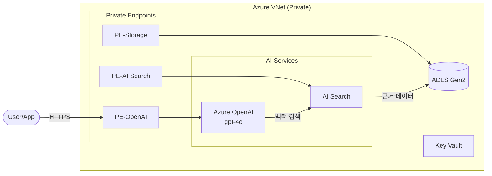

# 아키텍처 다이어그램 생성 가이드

## 사용 라이브러리: `diagrams`

Python `diagrams` 라이브러리(Diagram as Code)를 사용하여 Azure 아이콘 기반 PNG 다이어그램 생성.
Graphviz를 백엔드로 사용하므로, 설치가 필요하다.

```bash
pip install diagrams --break-system-packages -q
apt-get install -y graphviz -q 2>/dev/null || true
```

## 사용 가능한 Azure 노드 (주요 AI/Data)

```python
# AI/ML
from diagrams.azure.ml import CognitiveServices, MachineLearning, BotService

# Analytics/Data
from diagrams.azure.analytics import (
    AnalysisServices,
    DataFactory,
    DataLakeStoreGen1,  # ADLS 아이콘으로 사용
    Databricks,
    EventHub,
    HDInsight,
    StreamAnalytics,
    SynapseAnalytics
)

# Storage
from diagrams.azure.storage import BlobStorage, DataLakeStorage, StorageAccounts

# Security
from diagrams.azure.security import KeyVaults

# Network
from diagrams.azure.network import VirtualNetworks, PrivateEndpoint, ApplicationGateway

# General
from diagrams.azure.general import Resourcegroups
from diagrams.azure.identity import ActiveDirectory
```

## 표준 다이어그램 코드 패턴

```python
from diagrams import Diagram, Cluster, Edge
from diagrams.azure.ml import CognitiveServices, MachineLearning
from diagrams.azure.analytics import SynapseAnalytics, DataLakeStoreGen1
from diagrams.azure.security import KeyVaults
from diagrams.azure.network import VirtualNetworks, PrivateEndpoint
from diagrams.azure.storage import BlobStorage

# 다이어그램 설정
graph_attr = {
    "fontsize": "14",
    "bgcolor": "white",
    "pad": "0.5",
    "splines": "ortho",  # 직각 연결선
    "nodesep": "0.6",
    "ranksep": "0.8",
}

node_attr = {
    "fontsize": "11",
    "fontname": "Arial",
}

with Diagram(
    "Azure AI/Data Platform Architecture",
    filename="architecture",  # .png 자동 추가
    outformat="png",
    show=False,  # 자동으로 열지 않음
    graph_attr=graph_attr,
    node_attr=node_attr,
    direction="LR",  # Left to Right
):
    # VNet 클러스터로 Private 리소스 묶기
    with Cluster("Azure Virtual Network\n(Private)"):
        with Cluster("Private Endpoints"):
            pe_openai = PrivateEndpoint("PE-OpenAI")
            pe_search = PrivateEndpoint("PE-AI Search")
            pe_storage = PrivateEndpoint("PE-ADLS")
            pe_kv = PrivateEndpoint("PE-Key Vault")

        with Cluster("AI Services"):
            openai = CognitiveServices("Azure OpenAI\ngpt-4o + embedding")
            search = MachineLearning("Azure AI Search\nSemantic Ranking")

        with Cluster("Data Layer"):
            storage = BlobStorage("ADLS Gen2\nraw / processed / curated")

        with Cluster("Security"):
            kv = KeyVaults("Key Vault\nSecrets & Keys")

    # 연결 관계
    openai << Edge(label="Vector Search") >> search
    search << Edge(label="Grounding Data") >> storage
    openai >> Edge(label="API Key") >> kv

    # 외부 접근
    from diagrams.azure.identity import ActiveDirectory
    user = ActiveDirectory("User / App")
    user >> Edge(label="HTTPS / Private") >> pe_openai
    pe_openai >> openai
    pe_search >> search
    pe_storage >> storage
    pe_kv >> kv
```

## 자주 쓰는 Edge 스타일

```python
# 데이터 흐름 (실선 파란색)
Edge(color="blue", label="데이터 흐름")

# API 호출 (점선)
Edge(style="dashed", label="API 호출")

# 의존성 (빨간색)
Edge(color="red", style="dotted", label="의존")

# 양방향
Edge(forward=True, reverse=True, label="동기화")
```

## 대체 방법: Mermaid (diagrams 설치 실패 시)

```markdown

```

## 아이콘 매핑 (서비스 → diagrams 클래스)

| Azure 서비스 | diagrams 클래스 |
|-------------|----------------|
| Azure OpenAI | `diagrams.azure.ml.CognitiveServices` |
| AI Search | `diagrams.azure.analytics.AnalysisServices` |
| Microsoft Fabric | `diagrams.azure.analytics.SynapseAnalytics` (대체) |
| ADLS Gen2 | `diagrams.azure.storage.DataLakeStorage` |
| Key Vault | `diagrams.azure.security.KeyVaults` |
| AI Hub/AML | `diagrams.azure.ml.MachineLearning` |
| ADF | `diagrams.azure.analytics.DataFactory` |
| VNet | `diagrams.azure.network.VirtualNetworks` |
| Private Endpoint | `diagrams.azure.network.PrivateEndpoint` |
